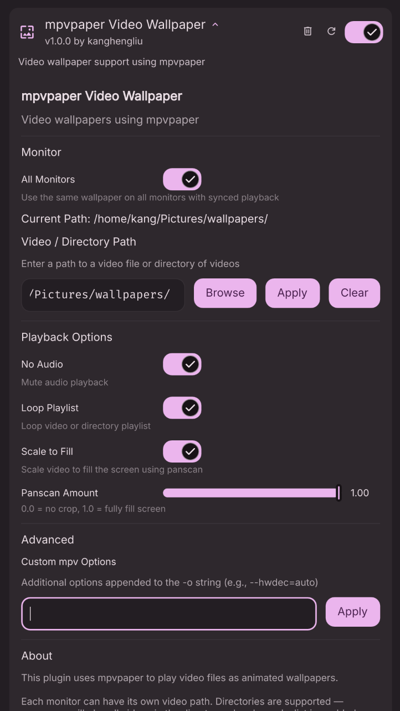

# DMS-mpvpaper plugin

A DankMaterialShell plugin for [mpvpaper](https://github.com/GhostNaN/mpvpaper).



## Installation

Only manual installation for now.
### Manual Installation
```bash
# Copy plugin to DMS plugins directory (create it if it doesn't exist)
cp -r dms-mpvpaper ~/.config/DankMaterialShell/plugins/

# Enable in DMS settings under Plugins tab.
```

## Acknoledgements
 - Inspiration: [dms-wallpaperengine](https://github.com/sgtaziz/dms-wallpaperengine)
 - The wonderful [DankMaterialShell](https://danklinux.com/)
